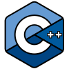

## Hello there Fellow Panda! 
*Who stumbled upon my measly profile* 👋 
<br/>

______________________________________________________________________________________

### Languages and frameworks I have worked on :
<div>
  
All these (kinda short 🐼 and lazy) years, I have used many different languages and frameworks/stacks on a project by project basis to build a few things with my passion (might not be the best at them), I still a consider comfort zone but I ain't giving up any challenge when it comes to learning anything new. You can call me a <strong>Wanderer</strong> for now, but I don't plan on doing it for eternity. But I always remember this quote
</div>
<br/>

> "If you only do what you can do, you will never be more than you are now." - **Master oogway** 🐢 *(Kung Fu Panda)*
#

### Had a good amount of experience with - 

<br/>
<br/>

[][Cuda]
[][directx]
[][cplusplus]

[][react]
[][html5]
[][css]
[][scss]
[][js]
[][ts]
[][firebase]
[][python]
[][tensorflow]
[][flutter]

<br/>
<br/>
<br/>

<br/>


#

#### Kinda tinkering with or less dived into(not as proficient with 🌱)-

<br/>
<br/>
<br/>

[][gcloud]
[][node.js]
[][csharp]
[][rust]
[][rust]

<br/>
<br/>
<br/>
<br/>

### Tools I actively use - 

> I am not including git and related stuff 😉 obviously

<br/>
<br/>
<br/>

[][androidstudio]
[][visualstudio]
[][vscode]
[][pycharm]
[][pycharm]
[][cmake]
[][figma]
[][blender]
[][adobe]

<br/>
<br/>
<br/>
<br/>

___________________________________________________________________________________


#### 🤔 What am I currently doing:

- <div> 
  
  I am also working on an application called <a href="https://summarize.dev/"><strong>Summarize</strong></a> (Name explains what it does probably well) 
  </div>
 
- Building a x16 bit CPU emulation *(kinda stale atm)*
- Fighting for college ! 👊🏻

#### 💬 Ask me about
 Space, Science, Physics, little bit of CS obviously. 
 > NOTE : Politics = No entry zone ⛔

📫 How to reach me:
```cpp
// I do sometimes write buggy code here is one

std::string email = "siddharthsinha9752@gmail.com";
std::string twitter = "@Sid_s911";
std::string medium = 'https://medium.com/@siddharthsinha9752' // soon, one day I will beat William Shakespeare at blogging

```

#### ⚡ Fun fact
I love sports and games and like rural area than urban. I don't think I have to mention that I love pandas💙💖!
Oh yeah anime! How dare I forget that. 

[Cuda]: https://docs.nvidia.com/cuda/
[cplusplus]: https://docs.microsoft.com/en-us/cpp/?view=msvc-160
[directx]: https://docs.microsoft.com/en-us/windows/win32/direct3d12/direct3d-12-graphics
[python]: https://www.python.org/
[react]: https://reactjs.org/
[html5]: https://html.com/html5/
[css]: https://developer.mozilla.org/en-US/docs/Web/CSS
[scss]: https://sass-lang.com/
[js]: https://developer.mozilla.org/en-US/docs/Web/javascript
[ts]: https://www.typescriptlang.org/
[firebase]: https://firebase.google.com/
[gcloud]: https://cloud.google.com/


[flutter]: https://flutter.dev/
[tensorflow]: https://www.tensorflow.org/
[rust]: https://www.rust-lang.org/
[node.js]: https://nodejs.org/en/
[csharp]: https://docs.microsoft.com/en-us/dotnet/csharp/

[pycharm]: https://www.jetbrains.com/pycharm/
[cmake]: https://cmake.org/
[adobe]: https://www.adobe.com/in/creativecloud.html?promoid=NGWGRLB2&mv=other
[vscode]: https://code.visualstudio.com/
[visualstudio]: https://visualstudio.com/
[androidstudio]: https://developer.android.com/studio/install
[blender]: https://blender.org
[figma]: https://www.figma.com/
